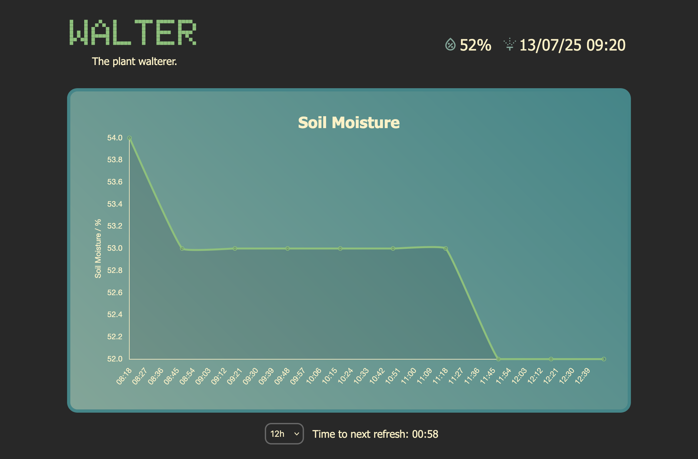

## WALTER. _The automatic plant watering robot._

_To see an example of the operating project go to: [walterbot.uk](https://walterbot.uk)_

### About The Project

WALTER is a automatic plant irrigation system that works using a Raspberry Pi PICO.

The circuit includes an OLED panel to view the last measured soil moisture and last water more directly. It consists of three sections: the OLED panel, the soil moisture sensor and the pump. 
During operation the sensor takes readings once every 30 minutes and then triggers watering below a certain threshold level and for a certain duration. The results are then displayed on the circuit's OLED display and sent to the external server.

There is also a backend which runs on a seperate server. This records readings from the pico and displays this on a graph. It can also be configured through the .env files to disable watering and just act as a data logger and prevent the pico from watering remotely. This system also allows email notification of users to prompt checking of the reservoir.

### Setting up

- Pull the repository. Upload the `pico` folder to the pi pico and install a relevant sh1106 driver. Add a `config.py` formatted in the form of the `example.config.py`.

- Upload the `web` folder to a suitable device to run the web server. Install dependencies and add a `.env` file formatted in the form of the `example.env`

- Run the web server and then run the pico program. 

_TODO_ List of parts and circuit components.

### Features

- Automatic soil moisture data logging
- Watering system based on soil moisture data
- Web interface for displaying data and last watered information
- Email notifications for alerts when watering occurs

    

